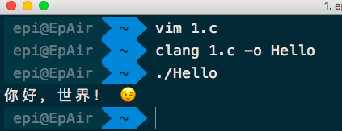

# 在 Mac 下开发 C 语言



## 前言

在mooc上的讨论区收到不少同学问怎么在自己的 Mac 上写 C 语言，Dev、CFree 也基本上都是 Windows 下的。本文将介绍如何在 Mac 上开发 C 语言

在 Mac 下开发 C 语言有两种方式，一种是命令行的 clang，一种是 IDE 式的 Xcode。重点介绍前者，因为前者为命令行，并且在写和编译前还有一些事情需要去做。后者比较庞大，仅仅用来写 C 有点高射炮打蚊子的意思，最主要是有界面，只需要记得几个单词就可以使用了

## 先决条件

阅读 clang 部分前，我假定你已经有最基础的 [Shell 使用本领](https://github.com/m4XEp1/Epis-Knowledge-Repo/blob/master/Terminal%20Tutorial/README.md)

下面开始介绍两个工具的安装和使用

## clang

clang 是一个苹果开发的命令行编译器，Mac 虽然是基于 Unix 但不是自带的，就 Minimal 版的 Linux 一样，需要额外的安装

接下来就介绍安装方法

如果嫌长 || 麻烦 || 不好懂 || 没耐心 || 没兴趣的话，请直接往下看 [Xcode](#xcode) 部分

### 试一波运气

打开你的终端：

```shell
$ clang
```
如果弹窗显示要安装，那就点击安装，这样是最方便的


### 如果没弹窗

```shell
$ xcode-select --install
```

### 编译

基本编译：

```shell
$ clang [filename]
```

上方的 `[filename]` 指的是你已经写好的文件名字，编译默认生成的结果是 `a.out`

例如：

```shell
$ clang 1.c
```

指定生成的程序文件名字：

```shell
$ clang [filename] -o [filename]
```

选项 `-o` 的意思是 output ，-o 的后面跟上你想要的名字

例子：

```shell
$ clang 1.c -o hello
```

### 执行

```shell
$ ./[filename]
```

例子：

```shell
$ ./hello
```


### 编辑

你可以下载 [sublime](https://www.sublimetext.com/), [nodepad++](https://notepad-plus-plus.org/)，或者使用 [nano](https://github.com/m4XEp1/Epis-Knowledge-Repo/blob/master/Terminal%20Tutorial/README.md#nano---%E5%91%BD%E4%BB%A4%E8%A1%8C%E4%B8%8B%E7%9A%84%E5%8F%AF%E8%A7%86%E5%8C%96%E7%BC%96%E8%BE%91%E5%99%A8) 作为编辑器

编辑完成后保存到你想要的位置，编译前 cd 过去或者直接带路径也可以

尽量保存在用户目录下，这样方便找

### 更多编译命令

左转 [Compile C on command](https://github.com/m4XEp1/Epis-Knowledge-Repo/blob/master/Compile%20C%20on%20command/README.md)

当然 GNU 家的 gcc 和苹果家的 clang 会有一些选项是不同的，请结合实际操作自行判断

## Xcode

### 安装

打开 App Store，搜索 `Xcode`

其中一个带锤子的蓝颜色图标就是 Xcode


点击安装，过程会有点久，足足有 5 个多 G

为什么不先写 Xcode 而是 gcc 呢，因为 Xcode 安装的时候会带上 gcc，会影响安装的正确性

### 第一次使用

Mac 的安装比较人性化，不像 Win 一样还要自己选择一大堆的设置

打开你的 Xcode，第一次会让你接受一个 License，点击 `Agree`


之后输入你的用户密码

接着会安装一些东西，等待


完成后，会出来一个窗口

### 新建一个项目


我们选择 `Creat a new Xcode project`

接着会弹出一个标题为 `Choose a template for your new project:` 的窗口，标题的下面我们选择 `macOS`，接着选择 `Command Line Tool`，然后点击下方的 `Next`


在新出来的页面里，在 `Product Name` 设置你的项目名字，下方的 `Language` 下拉菜单里选择 `C`，`Organization Identifier` 里可以随便写个东西


上图的名字可以做个参考

接着会问你存在哪，我建议是在用户目录下存一个文件夹专门放置你的 Xcode 项目，这样找代码也方便找。同时建议取消打勾 `Creat Git repository on my Mac`，因为我们暂时用不到这个


点击`Create`，接着会出来Xcode的界面

### 编辑


左边是我们的项目文件，你可以看到一个叫做 `main.c` 的文件，单击它


编辑区就会显示文件的内容了，它默认给了个 Hello World 的输出，你可以开始写你想要的东西

如果你觉得文字字体太小，按下键盘的 `command` + `+`，就可以放大。你也可以在上方菜单栏的 `Editor -> Font size -> Increase`

### 运行

写好之后，左上角有个播放的按键，单击它


第一次使用会问你是否打开开发者模式，点击 `Enable`，输入你的密码


如果代码没有写错的话，会弹出一个提示 `Build Succeeded`，下方最左边有一个向上的箭头，单击它，就可以看到运行结果了


右边的窗口为结果

如果你写错代码了，会有提示


如果你的程序需要输入，运行的时候在下方右边的窗口里输入就可以


### 中止运行

可能你的程序运行到一半但还没有结束，你不想继续了，可以点击播放按键旁边的停止键，来停止你正在运行的程序


### 判断输入和输出的部分

Xcode 使用是否为粗体来让你区分什么是你输入的什么是程序输出的，如图


### 下次使用

如果你没有取消勾选欢迎界面下方的选项，在下次启动 Xcode 的时候窗口的右边会有你的项目，或者再新建一个，也是可以的

## 后记

写本文的时候的机子配置是 Macbook Air 13' ，可能没法顾全安装中产生的所有问题。如果有遇到问题且本文没有讲到的，请给我提 [issue](https://github.com/m4XEp1/Epis-Knowledge-Repo/issues/new)，谢谢