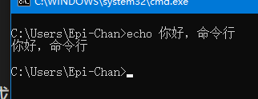
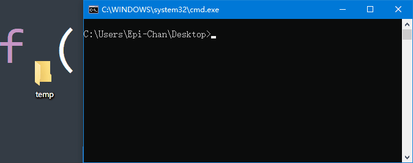
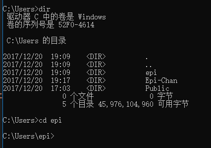
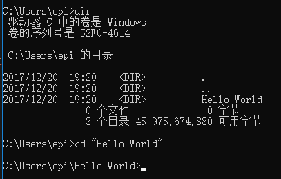
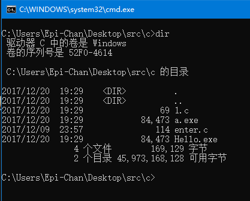
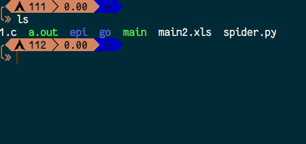

# cmd 入门

## 第一个命令

``` batch
> echo 你好，命令行
```

上方的阴影区域就是命令，其中由三个部分组成


`>` 是 prompt，默认存在，所以我们**只需要输入** `echo 你好，命令行`

`echo` 是我们要运行的程序，___中间有一个空格___，`你好，命令行`是我们给它的参数

参数的意思是，我在程序启动的时候给了它一些东西，它会把这个东西拿去使用，比如在 C 语言里，我们读进一个数然后再输出，参数实际上是运行前就给它了

敲完之后我们敲`回车`



然后屏幕上出来了`你好，命令行`，这个是`程序的输出`

你也可以

``` batch
> echo "Hello World"
```

在命令行程序里，给定参数的时候，如果参数中间有空格，用双引号把它包起来


## 列出当前目录的东西 - dir

```batch
> dir
```

这个命令是列出当前路径下的所有`文件`和`文件夹`


每一行中标了 `<dir>` 的为文件夹 (diretory)

## 新建一个文件夹 - mkdir

``` batch
> mkdir epi
```

这个命令是用来新建文件夹的，我们可以用 `dir` 来看创建的结果


`epi` 只是我用来做实验的，当然你们可以自己起名字

上图中我用`管理员权限`打开的，因为在C盘某些文件夹下新建文件夹等操作会涉及权限问题

## 删除文件 - del ###

```batch
> del xxx.jpg
```

这样，就可以删掉那个叫做 `xxx.jpg` 的图像文件了

你可以使用 `dir` 来查看删除的结果

## 删除文件夹 - rd

```batch
> rd epi
```

这样你就可以删除那个叫做 `epi` 的文件夹了

但是，这样子操作的前提是文件夹是**空的**

删除非空文件夹时你应该先删除文件夹里所有的文件以及文件夹

```batch
> del epi
```



## Goto Anywhere - cd

既然涉及了路径，有的时候我们要去别的路径下，那么要使用 `cd` 命令，带我们过去

```batch
> cd epi
```

意思是进入一个叫做 `epi` 的文件夹



这时候我们就会看到，路径变了

如果我们有一个文件夹的名字是`带了空格`的呢？那就加上双引号



回到上一个文件夹怎么办呢？

```batch
> cd ..
```

`cd` 加上**一个空格**再写两个 `.`


记得**参数之间是有空格的**

如果你不想一直敲 cd 进入某个文件夹，你想一次进入，可以把地址复制下来


```batch
> cd [你所复制的内容]
```

然后就会快速的过去了


我们的电脑硬盘一般都有几个分区，如果要切换，就敲那个`盘符` + `半角冒号`，如：

```batch
> D:
```


这样就会去到 D 盘了

操作上述那个复制路径的命令的前提是，盘符相同。如果不相同，先换所在分区再操作

## 运行目录下面的程序

假定我们现在有一个叫做 `Hello.exe` 的用 C 语言说 Hello 的程序，就在我们所在的目录下



直接敲名字即可运行(也可以带上那个 `.exe`)

```batch
> Hello
```


然后你会发现，不用加上 `system("pause")` 也不会闪退

## 清空屏幕上的文字 - cls

命令敲多了，命令窗口总会有一堆文字，我们需要清屏命令来清除它

* Before


```batch
> cls
```

* After


## 打开某一个文本文件 - more

`more` 命令会把参数所表示的文件的内容输出到屏幕上

```batch
> more 1.c
```


## 快速补全

我们都知道，如果某一个命令又臭又长，敲起来会很难受

假定我们还是那个 `Hello World` 文件夹


`cd` 时候敲一个 `H`，接着按下键盘上的 `Tab` 键，也就是切换大写的上面那个，就会出现完整的" Hello World "

当然，这里只敲一个 H 是因为目录下只有一个以 H 开头的文件/文件夹，如果有多的，就输入直到那个字母`仅有一个可配对`的为止

