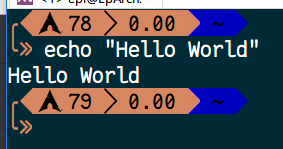
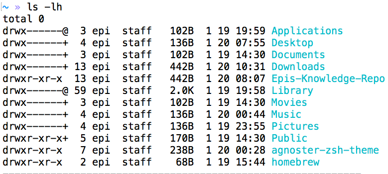
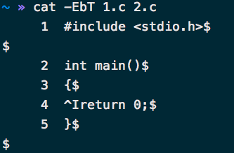
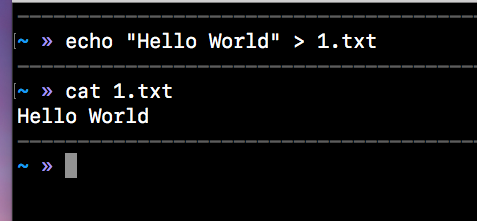
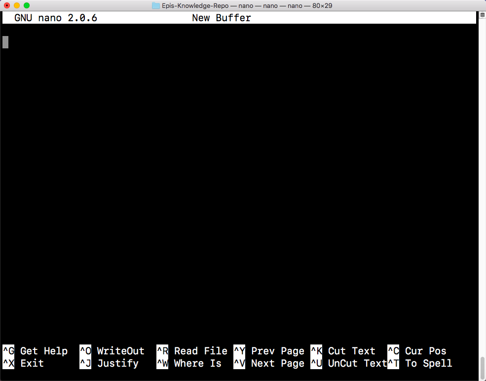

# Linux命令入门篇

在往下阅读前提示，`$` 是代表着普通用户和 Shell Prompt，不是让你输入$

`.` 代表着`当前文件夹`

`..` 代表着上一个文件夹

`/` 为根目录

`~` 为用户目录

每个命令的格式都是 名字 + 参数 ，参数间使用空格作为分割

如

```shell
$ ls ~/.oh-om-zsh -l -a -h
```

运行 ls 程序，参数分别是 `~/.oh-my-zsh`，`-l`，`-a`，`-h`

你可以在 [Ubuntu 官网](http://cn.ubuntu.com/)，[CentOS 官网](https://www.centos.org/) 等地方下载一个桌面版的 Linux 来练习接下来的这些命令

这些命令大部分同样在 Mac OS 上适用，因为他们的 Shell 都是 bash

不适用的我会给出详细标注

学完这些，你应该会的是：

* 查看目录
* 查看环境变量
* 运行程序
* 查看文本文件的内容
* 知道自己姓甚名谁
* 创建/删除 文件/文件夹
* 关机与重启
* 拷贝文件
* 知道自己在哪个路径
* 创建环境变量
* 用自己喜欢的方式简写命令
* 纯命令行的编辑文本

## echo

和 win 下的 cmd 同理，但是会有细微差别

```shell
$ echo "Hello World"
```



没有双引号的时候，你也可以用 `\ ` 来转义空格字符


图上三行命令作为示范

## ls - list

`ls` 命令的作用和 win 上的 `dir` 一样，是列出当前目录下的文件和文件夹的

```shell
$ ls
```

默认会出来非隐藏的文件和文件夹

如果要查看隐藏文件，使用 -a 选项：

```shell
$ ls -a
```

这些都是仅仅的打印出来，如果要查看详细信息，使用 -l 选项：

```shell
$ ls -l
```


从左到右的信息分别是：文件类型以及读写权限，文件硬链接数量，所有者，用户组，文件大小，修改时间，文件名字

第一列的第一个字符表示类型，d 是文件夹 (directoty)，l 是硬链接 (link)，- 代表文件。l 的后面还会有一个 -> 表示它链接到什么东西上

同时显示详细信息和隐藏文件：

```shell
$ ls -la
```

相当于

```shell
$ ls -a -l
```

```shell
$ ls -l -a
```

除了 ls 外顺序调换没关系的，-la 只是 ls 程序方便了我们一丢丢而已

这里的 ls 是程序名字，-a -l 是传给 ls 的参数，ls 程序会分析参数来做事情


-l 的前提下，想查看可读性较好的文件大小：

```shell
$ ls -lh
```

-h 的意思是 "human readable"，增加可读性的选项



大小单位这个就不在这啰嗦了

## cd

和 win 下的 cd 是一样的

去根目录

```shell
$ cd /
```

回到用户主目录

```shell
$ cd ~
```

或者是

```shell
$ cd
```

## whoami - 我是谁

```shell
$ woami
```

此命令执行后输出当前用户的名字

## mkdir - 创建文件夹

和win下同理，创建目录用的

## cat - 拼接文件

cat 和 win 下的 more 类似

如果你单纯的想查看`一个文件`

```shell
$ cat [filename]
```

如果你想把两个文件的内容`拼接`起来后输出

```shell
$ cat [file1name] [file2name]
```

如图


### 其它选项

-E，在输出的每一行末尾加上 $ 符号

-b，显示行号

-T，用 ^I 表示一个 Tab

其中选项可以合起来，如

```shell
$ cat -EbT 1.c 2.c
```



## rm - 删除文件

rm 命令是用来删除文件/文件夹的

```shell
$ rm 1.c
```

这样是删除那个叫做 `1.c` 的文件。若要删除文件夹，使用 -rf 选项：

```shell
$ rm -rf [repo name]
```

递归删除一个文件夹，删除里面所有的内容

提示，不加 `-rf` 是不会通过的，因为不是文件

## pwd - 显示完整路径

在 Linux 的命令行里，默认不显示路径全部内容的

显示完整路径：

```shell
$ pwd
```

## cp - 拷贝文件

```shell
$ cp [file] [path]
```

图上的命令为例子：


## sha256sum - 查看文件的文件指纹（Mac 环境不适用）

我们从网上下载一个东西的时候，为了安全我们是需要验证文件指纹的

```shell
$ sha256sum [filename]
```

输出的就是那个文件的 sha256sum


当然有的时候只有 sha1sum，那就

```shell
$ sha1sum [filename]
```


你也可以将输出的文本传给 sha256sum 来看它的 sha256sum 值：

```shell
echo "Hello World" | sha256sum
```

如果你想在 Mac 上用这个工具的话，确保你已经安装了 brew，然后

```shell
$ brew install coreutils
```

之后就可以：

```shell
$ gsha1sum [filename]
```

coreutils 是一个 GNU 的工具合集，可以自己探索

## sudo - "super user do"

这是一个带有管理员权限的命令。安装程序，关机等都需要这个命令

```shell
$ sudo [command]
```

怎么样判断你需不需要这个命令？如果你执行某一个命令的时候出现了 `Permission denied`、`Permission` 等等字眼，那就是权限不够了


比如说，一台服务器，支撑着某个程序的后台或者某个网站，肯定是不允许随随便便关机的。但是有时候一起负责这个服务器的某个人要登录上去修改数据，但是项目里不允许他进行开关机等带有权限的操作，boss 就不会给它开放 sudo

把自己添加进 sudo 是另一门学问了……

## shutdown/reboot - 关机和重启

一分钟后关机：
```shell
$ sudo shutdown
```

取消这个关机：

```shell
$ sudo shutdown -c    #c 是 cancel 的意思
```

立即关机：

```shell
$ sudo shutdown now
```

重启系统：

```shell
$ sudo reboot
```

### 如果你是 Mac 的话

关机应该是这样的：

```shell
$ sudo shutdown -h now
```

now 是立即的意思

重启

```shell
$ sudo shutdown -r now
```

睡眠

```shell
$ sudo shutdown -s now
```

后面的 now 可以改成自己想要的时间，如 +20, yymmddhhmm

20 分钟后睡眠：

```shell
$ sudo shutdown -s +20
```

取消这个睡眠倒计时可以采用杀死进程的方式，执行上面命令的时候会输出进程的 pid


或者用 ps 查看当前进程：

```shell
$ ps -A
```

接着找到 shutdown -s +20 那一行


接着杀死这个进程：

```shell
$ sudo kill -9 882
```

其中 -9 等同于 -KILL

你可以再次执行命令 `ps -A` 查看进程是否已经被杀死

## 执行当前目录下的文件

```shell
$ ./[filename]
```

比如我们有一个写好了的程序叫做 `main`，执行它

```shell
$ ./main
```

`./`是为了区分当前目录和其它目录里已经添加了`环境变量`的程序区分开来，`.`代表着当前目录。你可能会问为什么代表了当前目录还要加 `/`，这是因为 Linux 的文件规则是`隐藏文件以.开头`，`./main` 的意思是当前`目录下的那个叫做 main 的程序`，`.main`代表着一个叫做 `.main` 的文件或文件夹，但不是当前目录，而是环境变量里的。所以这两个就不是一个意思了


## > - 将输出写进文本

这个不能算命令，它只是作为重定向的一个“工具”。我们有时候会需要把程序里的输出记录下来，这时候就要用到 `>`

做一个简单的例子吧，我们都知道 `echo "Hello World"`会把 Hello World 输出到屏幕上对不对，那么我们现在把这个输出写进文本里，假定那个文本文件就叫做 `1.txt`，那命令就是这个样子的

```shell
$ echo "Hello World" > 1.txt
```

`>` 的前面是命令，后者是输出的文件名字

如图：



当然，你也可以运行一个 HelloWorld 程序来写入到文本，完全可以

学习的过程中要学会举一反三

## env - 查看环境变量

环境变量简单的解释就是，装着路径的变量。用户执行命令的时候会在已有的环境变量里寻找，看看是否有这个命令，没有的话就会提示 `command not found`

```shell
$ env
```

当然你可以用 `echo` 来查看单独的变量，例如

```shell
$ echo $HOME
```

就会出现


## export - 添加环境变量

```shell
$ export NAME=~
```

上面的命令意思是，创建了一个叫做 `NAME` 的环境变量，它的路径是 `~`

`cd` 来看看是不是正确的

```shell
$ cd $NAME
```

或者 `$ export NAME=/usr/include` 啊之类的


## alias - 用自己喜欢的别名命名命令

有的时候一个命令很长很长，但是你又不想敲的这么累，你就可以这么做

```shell
$ alias DISMISS="sudo shutdown now"
```

上面的意思是，我把 `sudo shutdown now` 简写成了 `DISMISS`，这样执行 `$ DISMISS` 就等于执行了`$ sudo shutdown now`

当然，这样子只能本次运行有效。若要长久有效，请写到 `.bashrc`、`.zshrc` 之类的文件里，后续章节会讲到

你可以直接查看当前已有别名的命令

```shell
$ alias
```

## nano - 命令行下的“可视化”编辑器

假定你所使用的 Linux 是没有 GUI 的，只有一台显示器和键盘，那么我们要编辑文本的话，用 `echo` 不太现实，所以我们用 nano 来编辑文本文件

```shell
$ nano
```



于是我们打开了一个编辑器，这个就可以直接写东西了。控制就用方向键的上下左右

写完之后按下 `ctrl + O` 来保存 (Mac 上是 `Control键 + O`)，接着会让你写保存的文件名，写完按下回车就好了


退出的话，用 `ctrl + X`，图片上的 ^ 就是 ctrl 键 (Mac 上是 control 键不是 command 键)

如果要打开现有文件，把文件名字作为参数名

```shell
$ nano Hello.c
```

在编辑的时候，用 `ctrl + V` 翻到下一页，`ctrl + Y` 翻到上一页。`ctrl + P` 跳到下一行，`ctrl + X` 跳到上一行

这些命令就已经足够使用来编辑文本了，要想了解更多，在打开 nano 后按下 `ctrl + G`


下一篇：[Linux 初阶](https://github.com/m4XEp1/Epis-Knowledge-Repo/blob/master/Terminal%20Tutorial/Linux%20first%20stage/README.md)
