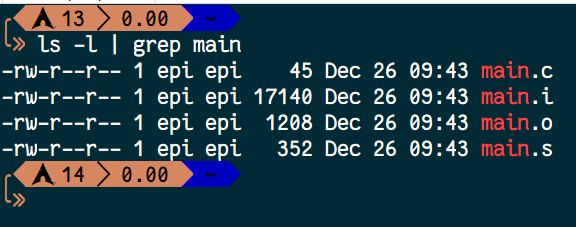
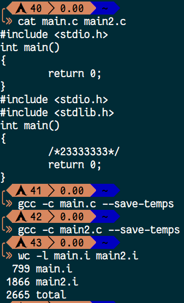

# 为什么要多个头文件

昨天收到一个很有意思的问题：

> 一般，C 把函数库中相关的函数归为一类，并为每个函数提供一个头文件。如 printf() 和scanf()都属于stdio.h头文件。为什么不规定所有的函数都归为一类，一个头文件就可以一网打尽，免得写程序时调用多种类型的头文件？。。。。。是不是跟程序运行效率有关系？如果一网打尽，一个头文件调用所有的函数，是不是程序调用了不需要用的函数，造成效率降低，运行变慢？

我曾经写过自己一个头文件，里面包含了我解题用的函数，以后也确实用过其中的一些。但后来理解了头文件的工作原理后，发现那样子做真的不好

现在就来解答一下为什么要多个头文件

## 什么是头文件

### 初学者只要知道

你用了那个头文件里的函数，就要把它include进来

### 详细 - Wiki原文

Many [programming languages](https://en.wikipedia.org/wiki/Programming_language) and other computer files have a [directive](https://en.wikipedia.org/wiki/Directive_(programming)), often called `include` (as well as `copy` and `import`), that causes the contents of a second file to be inserted into the original file. These included files are called copybooks or **header files**. They are often used to define the physical layout of program data, pieces of procedural code and/or [forward declarations](https://en.wikipedia.org/wiki/Forward_declaration) while promoting [encapsulation](https://en.wikipedia.org/wiki/Encapsulation_(object-oriented_programming)) and the reuse of code.

### Purpose

The include directive allows [libraries](https://en.wikipedia.org/wiki/Library_(computing)) of code to be developed which help to:

* ensure that everyone uses the same version of a data layout definition or procedural code throughout a program.
* easily cross-reference where components are used in a system.
* easily change programs when needed (only one master file to change).
* save time by not needing to code extensive data layouts (minor, but useful).

### C/C++

In [C](https://en.wikipedia.org/wiki/C_(programming_language)) and [C++](https://en.wikipedia.org/wiki/C%2B%2B), the `#include` [preprocessor directive](https://en.wikipedia.org/wiki/Preprocessor_directive) causes the [compiler](https://en.wikipedia.org/wiki/Compiler) to replace that line with the entire text of the contents of the named source file (if included in quotes: "") or named header (if included in angle brackets: <>); note that a header need not be a source file. Inclusion continues recursively on these included contents, up to an implementation-defined nesting limit. Headers need not have names corresponding to files: in C++ standard headers are typically identified with words, like "vector", hence `#include <vector>` while in C standard headers have identifiers in the form of filenames with a ".h" extension, as in `#include <stdio.h>`. A "source file" can be any file, with a name of any form, but is most commonly named with a ".h" extension and called a "header file" (sometimes ".hpp" or ".hh" to distinguish C++ headers), though files with .c, .cc, and .cpp extensions may also be included (particularly in the [Single Compilation Unit](https://en.wikipedia.org/wiki/Single_Compilation_Unit) technique), and sometimes other extensions are used.

These two forms of `#include` directive can determine which header or source file to include in an implementation-defined way. In practice, what is usually done is that the angle-brackets form searches for source files in a standard system directory (or set of directories), and then searches for source files in local or project-specific paths (specified on the command line, in an environment variable, or in a [Makefile](https://en.wikipedia.org/wiki/Makefile) or other build file), while the form with quotes does not search in a standard system directory, only searching in local or project-specific paths. In case there is no clash, the angle-brackets form can also be used to specify project-specific includes, but this is considered poor form. The fact that headers need not correspond to files is primarily an implementation technicality, and used to omit the .h extension in including C++ standard headers; in common use "header" means "header file".

For example:

```c
#include <stdio.h>  // Include the contents of the standard header 'stdio.h' (probably a file 'stdio.h').
#include <vector>  // Include the contents of the standard header 'vector' (probably a file 'vector.h').
#include "user_defined.h"  // Include the contents of the file 'user_defined.h'.
```

In C and C++, problems may be faced if two (or more) include files both in turn include the same third file. One solution is to avoid include files from including any other files, possibly requiring the programmer to manually add extra include directives to the original file. Another solution is to use [include guards](https://en.wikipedia.org/wiki/Include_guard)

### 翻译

许多编程语言和其他计算机文件都有一个指令，通常称为 include (以及 copy 和 import )，这会导致将第二个文件的内容插入到原始文件中。这些文件被称为 copybooks 或头文件。它们通常用于定义程序数据的物理布局、过程代码和/或转发声明，同时促进封装和代码的重用

### 目的

include 指令允许开发的代码库有助于:

* 确保每个人在整个程序中都使用相同版本的数据布局定义或过程代码

* 在系统中使用组件时容易交叉引用

* 很容易在需要的时候更改程序(只有一个主文件需要更改)

* 节省时间，不需要编写大量的数据布局(小的，但是有用的)

### C/C++

在 C 和 C++ 中，#include 预处理指令使编译器将该行替换为已命名源文件内容的全部文本(如果包含在引号中)或指定标题(如果包含在尖括号:<>)；注意，头不需要是源文件。在这些包含的内容上，包括在实现定义的嵌套限制上，包含继续递归地进行。header 不需要有与文件相对应的名称：在 C++ 标准标头中，通常用单词来标识，比如“vector”，因此#include\<vector> ，而在C标准标头中有 “.h” 扩展名的文件名，如#include \<stdio.h> 。“源文件”可以是任何文件，任何形式的名称，但最常见的是名为“.h”扩展，称为“头文件”(有时 “.hpp” 或 “.hh” 来区分 C++ 头文件)，尽管C的文件， .c, .cc, 和 .cpp 扩展也可能包括(特别是在单个编译单元技术)，有时使用其他扩展。

这两种形式的 `#include` 指令可以确定哪些头文件或源文件包含在实现定义的方式中。在实践中，通常是尖括号的形式在标准系统目录搜索源文件(或目录)，然后在本地或具体项目的路径搜索源文件(在命令行上指定，在一个环境变量，或在一个 Makefile 或其他构建文件)，而形式引用不搜索标准系统目录中，仅在本地或搜索特定项目的路径。在没有冲突的情况下，也可以使用角括号形式指定具体的项目，但这被认为是不佳的形式。header 不需要与文件相对应的事实主要是实现技术，并用于省略。 .h 扩展包括 C++ 标准头；常用的 “header” 表示 “头文件” 。

例如:

```c
#include <stdio.h>         // 包含标准头文件 'stdio.h' 的内容(可能是一个文件stdio.h)
#include <vector>          // 包含标准头文件 'vector' 的内容(可能是一个文件vector)
#include "user_defined.h"  // 包含文件' user_define .h '的内容。
```

在 C 和 C++ 中，如果两个(或更多)包含文件同时包含相同的第三个文件，可能会遇到问题。一种解决方案是避免包含任何其他文件的文件，这可能要求程序员手动添加额外的包含指令到原始文件。另一个解决方案是使用 include guard

## 原理

上面那一大篇总结了以后就是：**在你 include 头文件的时候，编译预处理阶段会把你 include 的那个文件的内容还原到你 include 的那个位置**

## 实践出真理

假定我们写好了一段代码，引用了 `stdio.h` 这个文件

```c
#include <stdio.h>
int main()
{
    return 0;
}
```

在gcc下编译的过程是这样子的：

* 第一步，进行编译预处理，生成 .i 文件

* 第二步，编译，生成 .s 的汇编文件

* 第三步，汇编，生成 .o 的机器码文件

* 第四步，链接，生成最终 .exe 可执行文件

假定上一段代码我们保存成了 main.c ，然后使用 --save-temps 的选项去编译

```shell
$ gcc -c main.c --save-temps
```

然后生成了 .i .o .s



我们都知道了第一步生成的是 .i ，接着生成 .s 的汇编代码，汇编就不是我们能看懂的了

我们可以用wc命令看一下main.i有多少行

```shell
$ wc -l main.i
```


一共是799行，算上我们原来写的四行(不包括 #include <stdio.h>)

那 stdio.h 有多少行？

```shell
$ wc -l /usr/include/stdio.h
```


为什么会这个样子？编译预处理时都做了什么？

* 删除注释，系统是不看注释的
* 处理宏定义
* 把 include 指令包含的文件添加进来

如何验证第一步呢？再来一段代码好了

```c
int main()
{
    /*23333333*/
    return 0;
}
```

然后扔进预处理，查看文件：


然后那个 2333 的注释就被删掉了

除了我们的代码文件有注释，系统的头文件里也会有注释，所以在编译预处理的时候**删掉了这个注释**

这样讲是不是不太好理解，那我们试一下包含一个头文件和两个头文件的区别

main.c ：

```c
#include <stdio.h>
int main()
{
    return 0;
}
```

main2.c ：

```c
#include <stdio.h>
#include <stdlib.h>
int main()
{
    return 0;
}
```

然后查看一下两个文件的 .i 都有多少行

```shell
$ wc -l main.c
```

```shell
$ wc -l main2.c
```



就像我们说的一样， #include 指令是把尖括号带的那个文件插入到代码里，这样就可以解释为什么 main2.c 的行数比 main.c 要多了

所以，如果把所有函数都放在一个头文件里，后果是

* 编译更耗时
* 不方便其它平台的使用，有歧义
* 增加维护时的工作量
* ……